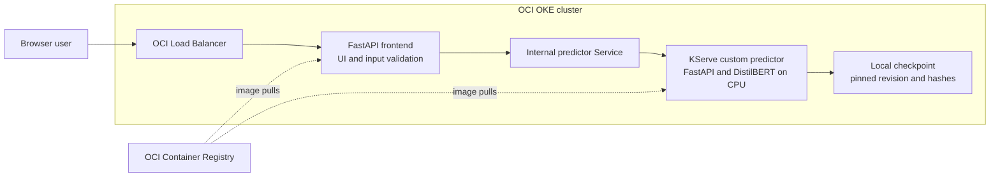
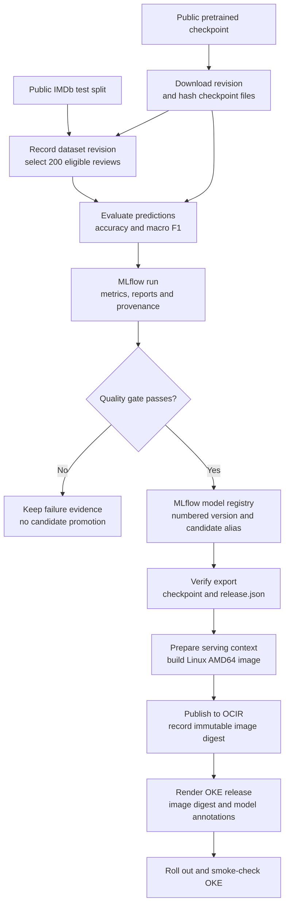
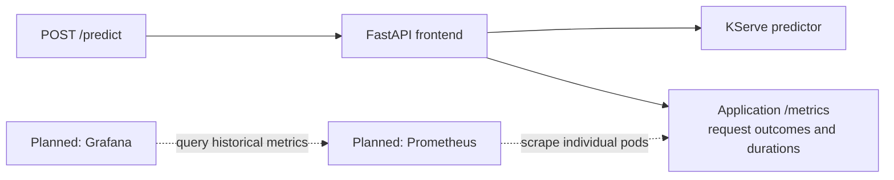

# ReviewOps — learning MLOps on OCI

ReviewOps is an English movie-review sentiment application and an evolving MLOps project on **Oracle Cloud Infrastructure (OCI)**. A browser sends a review to a FastAPI service; the deployed frontend delegates inference to an internal KServe predictor running DistilBERT on **Oracle Kubernetes Engine (OKE)**.

The project follows a model from acquisition and evaluation through MLflow registration, verified export, container packaging, and Kubernetes deployment. It starts with pretrained weights so the focus is on operating and releasing a model. It does not train or fine-tune a model today.

## Where we are now

| Milestone | Current state | Evidence and scope |
| --- | --- | --- |
| Local UI and sentiment API | Implemented and tested | Real checkpoint inference, validation, health and readiness tests. |
| Reproducible evaluation | Implemented | 200 eligible IMDb reviews, balanced by label; recorded dataset revision, selected row IDs, and checksums. |
| MLflow tracking and registry | Implemented locally | Passing and failing evaluation runs; numbered model versions and `candidate` alias. |
| Verified model export | Implemented | Candidate version **2**, reload checks, release metadata, and file hashes. |
| CPU serving containers | Built and locally checked | Linux AMD64 for OKE; Arm64 for local testing. Offline inference and failure/recovery evidence retained. |
| OCI registry and OKE deployment | Previously verified by the project owner | Original image published to OCIR; deployment, Service, and public load balancer smoke checks reported successful. |
| FastAPI → KServe on OKE | Previously verified by the project owner | Public smoke response identifies `inference_backend: kserve`; retained [smoke evidence](artifacts/container/smoke-oke-frontend-v1.json). |
| Application metrics | Local work in progress; separate release | `/metrics` instrumentation, tests, and local container evidence are being prepared separately. That code is not part of this cleanup commit; GitHub publication and OKE rollout are pending. |
| Prometheus and Grafana | Next | Collection, stored time series, and dashboards are not deployed by this repository yet. |
| DVC, Object Storage, Kubeflow Pipelines | Planned | Data/artifact versioning and automated release orchestration remain future work. |

These are milestone records, not a live cluster-status check. A retained smoke test establishes behavior at the time it ran; it does not establish current availability or production readiness.

## Architecture

### Online prediction: the deployed serving path

What happens when someone submits a review?



The frontend owns the browser UI and public API. The predictor owns tokenization and model execution. Setting `REVIEWOPS_PREDICTOR_URL` selects remote inference; the frontend does not load a local model or fall back to local inference if the predictor fails. Without that variable, the same application runs locally with a checkpoint from `REVIEWOPS_MODEL_DIR`.

KServe uses **Standard deployment mode**, a custom container, and the existing `/predict` HTTP contract. This project does not implement the standard KServe V2 inference protocol. The current predictor manifest fixes replicas at one; autoscaling and high availability have not been demonstrated.

The first frontend container shares the predictor packaging recipe and still includes model files and model dependencies, even though remote mode does not load them. A smaller dedicated frontend image is a planned improvement.

### Model lifecycle: how a candidate becomes a deployable artifact

How do we know which model and evaluation produced a release?



MLflow registration creates a version of an evaluated package; it does not train new weights. Version 2 uses the same pretrained checkpoint as version 1. The release ties together the MLflow run, registry version, upstream model revision, and checkpoint hashes. The container digest identifies the deployable image.

The lifecycle currently runs through Python scripts and documented commands. The renderer checks release metadata and digest syntax; it cannot prove that an arbitrary supplied registry digest contains the expected image. Publication evidence and smoke verification complete that link. Kubeflow automation is future work.

### Observability: current instrumentation and next-stage services



The separate local metrics implementation exposes request counts by outcome, frontend duration histograms, and successful predictor compute-duration histograms. These additions are not yet included in this GitHub snapshot. Frontend duration includes backend waiting and ends at response headers; predictor duration is reported compute time. Neither is browser end-to-end latency. Metrics omit review text and client identifiers and reset when the process restarts. They measure service behavior, not model accuracy or drift.

## Why these choices

| Choice | Reason in this project | Tradeoff or current boundary |
| --- | --- | --- |
| Pretrained DistilBERT sentiment checkpoint | Begin with a useful inference task and concentrate on MLOps. | Binary English sentiment; no neutral class or domain adaptation. |
| CPU inference | Establish a serving baseline without requiring GPU nodes. | Production throughput and compute sizing remain unmeasured. |
| FastAPI and a small static UI | Keep API validation, browser interaction, and health checks easy to inspect. | Authentication, rate limits, and an ingress/TLS design remain later work. |
| Separate frontend and predictor | Distinguish application handling from model execution and failure. | An extra HTTP hop; shared image packaging still needs refinement. |
| KServe custom container in Standard mode | Reuse the tested model/API container with Kubernetes model-serving resources. | No V2 protocol, scale-to-zero, or demonstrated autoscaling. |
| MLflow with local SQLite storage | Track evaluation evidence and model versions in a manageable local setup. | SQLite metadata and artifact files both need backup; this is not a shared authenticated registry service. |
| Balanced, deterministic IMDb sample | Make repeatable evaluation practical on a laptop and record eligibility decisions. | A 200-row short-review sample is not full IMDb benchmark performance. |
| Explicit quality gate | Demonstrate refusing a release when evidence misses a threshold. | Accuracy and macro F1 ≥ 0.80 are teaching thresholds, not business acceptance criteria. |
| Safetensors, local weights, hashes, and pinned image digests | Make artifacts identifiable and detect accidental changes; run inference offline. | Hashes are integrity checks, not signatures establishing publisher trust. |
| Separate serving and evaluation dependencies | Keep MLflow and raw evaluation data out of runtime containers. | The frontend still includes unused model dependencies today. |
| OKE and OCIR | Connect the application lifecycle to OCI Kubernetes and registry delivery. | Cluster, registry access, and pull secrets are provisioned separately. |

## Evaluation results and model limits

The retained evaluation reports **92% accuracy**, **0.920 macro F1**, and **16 incorrect predictions** on 200 selected reviews, with no inference failures. The sample contains 100 reviews per label, uses seed 42, and is filtered to the serving character/token limits. See the [evaluation results](docs/reviewops-evaluation-results.md) and [machine-readable report](artifacts/review_evaluation/report.json).

The checkpoint is `distilbert/distilbert-base-uncased-finetuned-sst-2-english`, recorded at revision `714eb0fa89d2f80546fda750413ed43d93601a13`. The downloaded model card and license metadata are retained with the checkpoint; [source metadata](artifacts/review_model_source.json) remains in Git.

A prediction score is not measured accuracy or a calibrated probability guarantee. Sarcasm, mixed sentiment, other languages, and different domains can produce misleading results. The application does not detect language. These results do not establish production capacity or independence from all upstream training material.

Historical evaluation reports retain the source hashes from when they were generated. Removed legacy filenames in that provenance are historical records, not runtime dependencies.

## Run locally

Use Python 3.12. Model weights, the virtual environment, evaluation data, MLflow database, exported checkpoints, and generated build directories are excluded from Git; a fresh clone needs dependency installation and a model download.

```bash
git clone https://github.com/shivangpandya/mlops-on-oci-solutions.git
cd mlops-on-oci-solutions
python3.12 -m venv .venv
.venv/bin/python -m pip install -r requirements-mlops.txt
.venv/bin/python download_model.py
.venv/bin/python -m uvicorn app:app --host 127.0.0.1 --port 8000
```

Open [the local UI](http://127.0.0.1:8000) or [interactive API documentation](http://127.0.0.1:8000/docs). Initial download requires network access. The downloader resolves and records a revision on first use and reuses its local manifest afterward; a new clone is not automatically locked to the historical revision above. Compare source metadata before claiming an exact reproduction of the retained result.

```bash
curl http://127.0.0.1:8000/predict \
  -H 'Content-Type: application/json' \
  -d '{"text":"The movie was wonderful. I loved it."}'
```

Expect a positive or negative label, score, model ID, model revision, token count, `inference_ms`, and `inference_backend`. Review text is processed by the configured local or internal predictor and is not saved by this application.

| Route | Purpose |
| --- | --- |
| `GET /` | Browser review form. |
| `POST /predict` | Sentiment prediction. Strict text field; unknown fields rejected. |
| `GET /health` | Process liveness, independent of model readiness. |
| `GET /ready` | Checkpoint readiness or remote predictor readiness/identity. |
| `GET /metrics` | Planned metrics release; not available in this GitHub snapshot. |

Text is trimmed and must contain 1–2,000 characters and at most 512 tokens. Invalid input returns HTTP 422; text is rejected rather than silently truncated. Unavailable models, failed remote requests, and invalid predictor results return HTTP 503. `/health` stays available during predictor outages.

## Evaluate, register, and export

```bash
.venv/bin/python acquire_review_data.py
.venv/bin/python evaluate_reviews.py
```

Acquisition records data provenance under `data/reviews/`. Evaluation writes `artifacts/review_evaluation/report.json` and logs to local MLflow. A passing gate registers `reviewops-distilbert` and updates `candidate`; a failed gate retains evidence, exits nonzero, and does not promote a candidate.

```bash
.venv/bin/mlflow server \
  --backend-store-uri "sqlite:///$PWD/artifacts/mlflow/reviewops.db" \
  --host 127.0.0.1 --port 5000 --workers 1 --no-serve-artifacts
```

Open [MLflow locally](http://127.0.0.1:5000). Both database metadata and model artifact files are required to preserve the registry.

Export the numeric version actually created by your run; a new local registry does not already contain historical version 2:

```bash
.venv/bin/python export_review_model.py \
  --version 1 --output-dir artifacts/releases/local-v1
```

The destination must be fresh. Export verifies the package and writes a checkpoint plus `release.json`. Only load trusted registry packages: MLflow models-from-code execute Python when loaded.

## Container and OKE delivery

The delivery sequence is: export a verified candidate, prepare the build context, build and smoke-test the AMD64 image, publish to OCIR, record the pushed digest, render the release, and roll out to OKE. See the [OKE runbook](docs/reviewops-oke-runbook.md) for commands and the [frontend guide](docs/reviewops-kserve-frontend.md) for the atomic image/backend configuration rollout.

The runtime uses a non-root user, a read-only root filesystem, writable `/tmp`, CPU-only PyTorch, and startup/readiness/liveness probes. Local checks include offline prediction and outage/recovery behavior. Resource requests and limits are starting configuration, not a measured capacity recommendation.

`k8s/base/` is a template with an image placeholder; render it with `render_oke_release.py` after the published digest is known. `k8s/kserve/reviewops-sentiment.yaml` records the internal predictor configuration. Reusing that manifest in another tenancy requires its registry reference, namespace, and pull-secret configuration to match the target environment. The manifests do not provision an OCI cluster or registry credentials.

## What comes next

The proposed sequence builds on the current serving system:

1. **Finish the metrics frontend release.** Complete image smoke checks, publish its digest, roll out on OKE, and retain public prediction and `/metrics` evidence.
2. **Add Prometheus and Grafana.** Scrape individual frontend pods and build traffic, failure-rate, and latency dashboards. Define access and retention before expanding monitoring exposure.
3. **Reduce frontend packaging.** Build a dedicated frontend image without model weights and PyTorch while retaining the explicit KServe failure behavior.
4. **Version data and artifacts.** Introduce DVC and OCI Object Storage, documenting provenance, access, and reproducible recovery.
5. **Automate the lifecycle.** Use Kubeflow Pipelines for acquisition, evaluation, gate checks, registration, and release handoff. Preserve failure evidence at every stage.
6. **Measure operational behavior.** Exercise workload identity, private artifact access, compute sizing, replica scaling, and rollback under load. Fine-tuning and drift evaluation can follow a measured baseline.

These are planned milestones, not implemented capabilities or delivery dates.

## Repository map

| Path | Responsibility |
| --- | --- |
| `app.py`, `review_app.py` | FastAPI entrypoint, UI, validation, and probes. |
| `review_inference.py`, `review_remote.py` | Local checkpoint inference and HTTP predictor client. |
| `static/` | Browser interface. |
| `download_model.py` | Acquire checkpoint and record revision/hashes. |
| `acquire_review_data.py`, `evaluate_reviews.py` | Deterministic data acquisition, evaluation, and registry promotion. |
| `review_mlflow_model.py`, `export_review_model.py` | MLflow model wrapper and verified release export. |
| `prepare_container.py`, `Dockerfile`, `render_oke_release.py` | Build context, runtime packaging, OKE release rendering. |
| `k8s/`, `scripts/smoke_container.py` | Kubernetes configurations and deployed API smoke checks. |
| `tests/` | ReviewOps regression and integration tests. |
| `artifacts/` | Retained reports, source metadata, and container/smoke evidence. Large generated artifacts are ignored. |
| `docs/`, `OCI_REFERENCES.md` | Detailed guides, historical designs, and reference material. |

## Verify and read further

After downloading the checkpoint and installing the MLOps dependencies:

```bash
.venv/bin/python -m unittest discover -s tests -v
.venv/bin/python -m pip check
```

Tests exercise real local inference, temporary MLflow registries, export integrity, release rendering, remote HTTP failures. The separate metrics work adds metrics contracts. HTTP fixtures require permission to bind local ports. Smoke tests are a separate check of an actual running image or deployment.

- [Beginner architecture guide](docs/reviewops-beginner-guide.md)
- [Evaluation results](docs/reviewops-evaluation-results.md)
- [Container verification results](docs/reviewops-container-results.md)
- [OKE deployment runbook](docs/reviewops-oke-runbook.md)
- [FastAPI-to-KServe guide](docs/reviewops-kserve-frontend.md)
- [OCI references](OCI_REFERENCES.md)

Older design and implementation notes record the state at their milestone. Use this README and the relevant release guide for the current overview.
