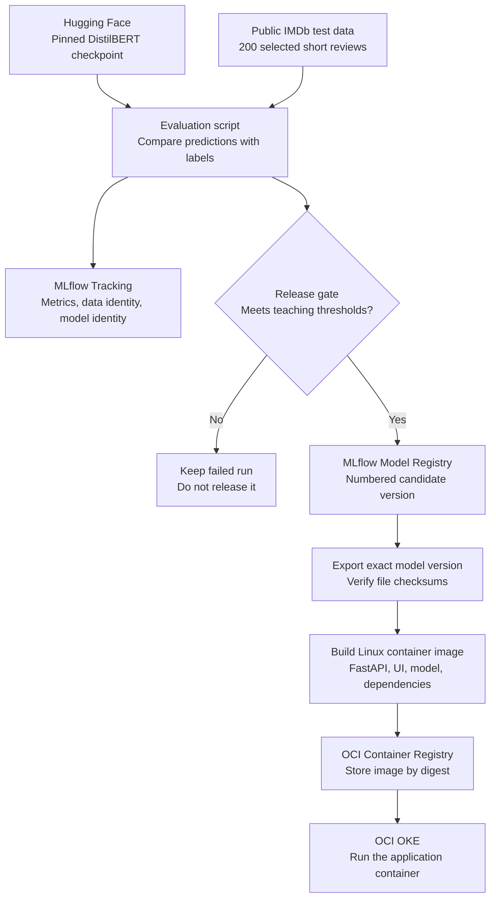
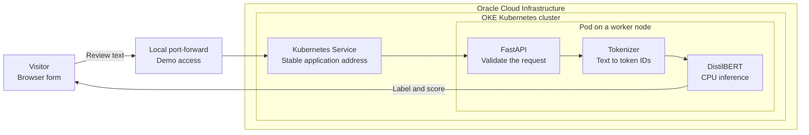
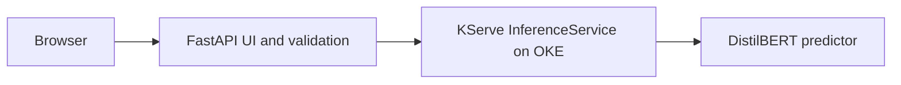

# ReviewOps: a beginner’s guide to MLOps on OCI OKE

**Audience:** people seeing machine learning operations and Kubernetes for the first time.  
**Purpose:** explain the project, why each component exists, and what to demonstrate at KubeCon.  
**Status:** the local sentiment application works. Public-data evaluation, local MLflow tracking/registration, and verified model export are implemented. AMD64 and Arm64 containers are locally tested. The user verified the original AMD64 application on OKE and the KServe predictor; the new frontend delegation rollout is pending. DVC, Object Storage, and Kubeflow Pipelines are later extensions.

## 1. Start with a familiar problem

Imagine a movie website receiving many reviews. Reading every review takes time. We want an application that suggests whether an English review expresses positive or negative sentiment.

A visitor enters: “The movie was wonderful. I loved it.” The application returns a positive label and a model score. This example has been verified with the current local model. The score measures the model’s preference between its two labels; it is not proof that the answer is correct.

This is a teaching application. Mixed opinions and sarcasm can confuse it, and it has no neutral category. A practical review workflow would let people correct mistakes.

**Opening words for your audience:**

> “We will start with a model that already exists. Our job is to test it, keep track of what we tested, and run that exact version reliably. That journey is what this MLOps demonstration covers.”

## 2. Four ideas before the tools

| Term | Plain-language meaning | ReviewOps example |
|---|---|---|
| Model | A program with learned numerical settings that transforms an input into a prediction. | DistilBERT predicts positive or negative sentiment. |
| Training | Learning those settings from examples. | The model’s publisher has already trained and fine-tuned our checkpoint. |
| Inference | Using a model to answer a new input. | A visitor submits a review and receives a prediction. |
| Evaluation | Comparing predictions with known answers. | We will compare model predictions with labels in public IMDb reviews. |

**MLOps** means the practices and tools used to evaluate, release, operate, and improve machine learning systems. A good model alone does not tell us which data was tested, which version is running, or how to recover from a bad release.

**Pretrained** does not mean proven suitable for our application. It means we can begin with evaluation instead of initial training. In this project, “local” means running on this computer’s CPU. The next stage moves inference into containers on OCI machines; it does not add training automatically.

## 3. Diagram: from a public model to a release

This diagram answers: **how will we decide which model artifact gets deployed?** Evaluation through model export and local image checks are implemented. The user completed OCIR publication and basic OKE delivery, then verified the KServe predictor. The new frontend delegation release remains pending cloud rollout.

Read it from top to bottom. Model files and labeled data enter evaluation. MLflow records evidence. Our own evaluation code enforces the gate; MLflow does not automatically decide whether a model is good. A passing model becomes a numbered candidate. We export that exact version, package it, and send the image to OKE.

The initial proposal uses accuracy and macro F1 of at least 0.80, both labels represented, and no inference failures. These are configurable teaching thresholds, not validated business requirements. Registration and deployment are separate actions: a registered candidate is not automatically a live service.

A **checksum** identifies file contents and helps detect changes. An **image digest** identifies the container image contents. Recording both links the evaluated checkpoint to the deployed image.

## 4. Diagram: one visitor’s request

This diagram answers: **what happens after someone clicks Analyze?** It shows the proposed deployment on OKE.

The result arrow summarizes the response returning along the same connection. The browser form is served by FastAPI in the same application container; it is not a separate frontend service.

The **tokenizer** translates words into numerical identifiers the model can process. The model runs inside the pod using files packaged in the image. It does not call Hugging Face for each review. In the initial design, live requests also do not depend on MLflow, DVC, or Kubeflow being available.

A **port-forward** creates a temporary connection from the presenter’s computer to the Kubernetes Service. Audience members do not get a public website from this setup. A public endpoint with authentication and HTTPS can be added as a separate stage.

## 5. Every component and why it is used

### Model preparation and release

| Component | What it does | Why we use it | Status |
|---|---|---|---|
| Hugging Face model repository | Supplies the public pretrained checkpoint and tokenizer files. | Avoids initial training and gives us an identifiable upstream model revision. | Used now. |
| DistilBERT | Classifies English text into positive or negative sentiment. | Offers a concrete pretrained-model example that already runs on the local CPU. | Used now. |
| Model manifest and checksums | Record the upstream revision and verify downloaded files at startup. | Help answer “Are these the files we expected?” | Used now. |
| Public IMDb labeled data | Supplies reviews with known positive/negative labels. | Lets us measure performance instead of relying on a few impressive examples. | Implemented locally. |
| Evaluation script | Selects reproducible examples, runs predictions, and calculates metrics. | Makes the test repeatable and applies the release gate. | Implemented locally. |
| MLflow Tracking | Records each evaluation run’s metrics, parameters, and artifacts. | Helps explain what was tested and compare runs. | Implemented locally. |
| MLflow Model Registry | Gives packaged models numbered versions and aliases. | Makes a specific model version discoverable for export and release. | Implemented locally. |
| SQLite | Stores local MLflow metadata in a database file. | Provides a database-backed registry for a single learner without a separate database service. | Implemented; local only. |
| Local artifact directory | Stores model packages and reports referenced by MLflow. | Keeps the first milestone small and inspectable. | Implemented locally. |

MLflow’s database contains metadata; large model files live in its artifact store. Copying only the database is not a complete backup. The initial local registry is not being proposed as a highly available, multi-user production service. [MLflow registry documentation](https://mlflow.org/docs/latest/ml/model-registry/workflow/).

### Application and Kubernetes

| Component | What it does | Why we use it | Status |
|---|---|---|---|
| Browser form | Accepts review text and displays a prediction. | Gives the audience an accessible way to use the project. | Used locally now. |
| FastAPI | Provides the web application and `/predict` HTTP endpoint. | Lets a browser or another application call the model through a documented interface. | Used locally now. |
| Shared inference code | Loads the verified model and performs predictions. | Will keep evaluation, registered-model inference, and the API consistent. | Used now. |
| Container image | Packages code, dependencies, and the exported model. | Creates one release package to test and deploy. | Built and tested locally; Arm64. |
| Dockerfile | Describes how to build that Linux image. | Makes packaging repeatable. Docker or a compatible builder such as Podman can build it. | Used now. |
| Kubernetes | Schedules application containers and maintains declared workload state. | Provides deployment, replacement, networking, and rollout primitives. | Planned on OKE. |
| Pod | Runs the application container on a worker machine. | Is the unit Kubernetes schedules and replaces. | Verified in user’s OKE output. |
| Deployment | Declares the desired image and number of pod replicas. | Enables controlled releases and replacement of missing pods. | Verified in user’s OKE output. |
| Service | Provides a stable internal address for ready pods. | Keeps clients independent of changing pod addresses. | Verified in user’s OKE output. |
| Startup and readiness probes | Check `/ready` until the model can serve predictions. | Prevent sending requests to a pod that has not loaded its model. | Configured in deployed workload. |
| Liveness probe | Checks `/health` to see whether the application responds. | Can trigger a restart when the process stops responding. It does not measure model accuracy. | Endpoint exists; probe planned. |
| CPU/memory requests and limits | Declare resource needs and bounds for the pod. | Help scheduling and prevent one workload from consuming unrestricted resources. | Planned; sizing requires measurement. |
| Namespace | Groups project resources within the cluster. | Makes naming, access controls, and cleanup easier to organize. | Verified in user’s OKE output. |
| `kubectl` | Sends management commands to Kubernetes. | Lets us deploy, inspect logs, check rollout, and demonstrate recovery. | Installed locally. |

One replica makes the first demo easier to understand, but replacement can cause a brief interruption. Replicas and worker capacity must be configured deliberately for availability. Kubernetes can replace a failed process; it cannot repair an inaccurate model.

### OCI services and later MLOps extensions

| Component | What it does | Why we use it | Stage |
|---|---|---|---|
| OCI: Oracle Cloud Infrastructure | Supplies the cloud environment. | Hosts our Kubernetes infrastructure and related services. | Cloud target. |
| OKE: Oracle Kubernetes Engine | Provides a managed Kubernetes service on OCI. | Lets us focus on our workload while using standard Kubernetes interfaces. | Next cloud milestone. |
| OCI worker nodes | Supply CPU and memory for pods. | Execute the actual model inference. | Next cloud milestone. |
| OCIR: OCI Container Registry | Stores container images for deployment. | Keeps the release package available for OKE to pull. | Next cloud milestone. |
| Registry pull secret | Supplies credentials for pulling a private OCIR image. | Allows authorized image retrieval without placing tokens in application code. | Next cloud milestone. |
| OCI networking | Connects cluster components and controls network access. | Supports the intended private deployment and administrative access. | Cluster prerequisite. |
| OCI IAM: Identity and Access Management | Controls access to OCI services and resources. | Gives users and workloads only the permissions they need. | Cloud prerequisite; workload identity later. |
| DVC: Data Version Control | Records dataset versions and optionally reproducible processing stages. | Lets us retrieve the exact evaluation data associated with a run. | Later extension. |
| OCI Object Storage | Stores files as objects in buckets. | Can hold DVC data and, after compatible configuration, MLflow artifacts. | Later extension. |
| Kubeflow Pipelines | Runs connected steps as a repeatable workflow on Kubernetes. | Can automate acquisition, evaluation, registration, and release preparation. | Later extension. |

OKE integrates with OCI identity, registry, storage, and networking services. Worker-node responsibilities depend on the chosen node type; our proposal uses managed CPU nodes. We still manage the application, access policies, capacity, and release checks. [OKE overview](https://docs.oracle.com/en-us/iaas/Content/ContEng/Concepts/contengoverview.htm), [private registry image pulls](https://docs.oracle.com/en-us/iaas/Content/ContEng/Tasks/contengpullingimagesfromocir.htm).

DVC complements Git by tracking data files and processing stages. Kubeflow Pipelines orchestrates workflow execution. Neither replaces a model registry. [DVC introduction](https://doc.dvc.org/start), [Kubeflow Pipelines overview](https://www.kubeflow.org/docs/components/pipelines/overview/).

## 6. Metrics without assuming a statistics background

| Metric | Question it answers | Example or interpretation |
|---|---|---|
| Accuracy | How often did the model choose the correct label? | If 170 of 200 predictions are correct, accuracy is 85%. This is an illustrative calculation, not our result. |
| Precision for positive | Of reviews predicted positive, how many truly were positive? | Useful when an incorrect positive prediction is costly. |
| Recall for positive | Of truly positive reviews, how many did we find? | Useful when missing a positive review is costly. |
| Macro F1 | How well did we balance precision and recall across both labels? | Computes F1 per label, then averages so both labels receive equal weight. |
| Confusion matrix | Which kinds of mistakes did we make? | Separates correct positive/negative answers from the two kinds of wrong answers. |
| Latency | How long did a request take? | We will measure warmed inference time and report units and test conditions. |

We propose 100 eligible reviews per class, selected reproducibly. Short-review eligibility matches the API’s 2,000-character and 512-token limits. We must report excluded reviews: the results apply to this sample, not automatically to every IMDb review. A model score on one review and accuracy across a labeled dataset answer different questions.

## 7. Show OCI benefits through evidence

| Benefit to explain | Demo evidence | Limit of the claim |
|---|---|---|
| Managed Kubernetes with standard interfaces | Deploy the workload and inspect it with `kubectl`. | Deployment, Service, and probes are Kubernetes capabilities running on OKE. |
| Repeatable release delivery through OCIR | Show the recorded model revision, registry version, and deployed image digest. | The linkage must be generated and checked; naming an image is insufficient. |
| Recovery from a lost application pod | Delete one demo pod and show its Deployment creating a replacement. | One replica may interrupt requests; replacement does not promise zero downtime. |
| CPU execution without initial GPU provisioning | Run predictions on the selected CPU worker shape; record memory and CPU use. | Do not claim CPU is always preferable or OCI is cheaper without measurements. |
| Private artifact access | Later, show permitted workload access to an Object Storage bucket. | Not implemented in the first deployment; access and policies need configuration. |

**Words you can use:**

> “OCI supplies the infrastructure and integrated services. Kubernetes manages our application workloads on OKE. MLflow records which model we evaluated. Together, they give us a traceable path from an evaluation result to a running service.”

## 8. A presentation walkthrough

Use this as a script once each corresponding stage has been implemented and verified.

1. **Show the use case.** Submit a clearly positive and a clearly negative review. Explain that a pretrained model is making the predictions.
2. **Show a limitation.** Try a mixed opinion. Explain that a high score can still accompany a wrong or oversimplified answer.
3. **Ask how we know it is useful.** Open the public-data evaluation report. Explain accuracy and show mistakes in the confusion matrix.
4. **Show the evidence record.** Open the MLflow run. Point to the dataset checksum, model revision, and measured metrics.
5. **Show the release decision.** Explain why a passing run can register a candidate. Show a genuine failed-gate run if one has been recorded; do not fabricate results.
6. **Show what is deployed.** Connect the numbered model version to the exported files, OCIR image digest, and OKE Deployment.
7. **Show an operating event.** Delete a demo pod and watch replacement and readiness. Explain that recovery follows the desired state declared in the Deployment.
8. **Show rollback.** Once a second release exists, roll back to the prior verified image. A restarted copy of the same image is not a different model release.
9. **Close with the next learning stage.** Explain that DVC will version data and Kubeflow Pipelines will automate the steps we performed manually.

**Closing words:**

> “We began with a model someone else trained. We added evidence, versioning, packaging, and reliable operation. The same lifecycle becomes even more valuable when we start fine-tuning or training our own models.”

## 9. Questions beginners commonly ask

**Are MLflow and OCI Container Registry the same thing?** No. The MLflow Model Registry catalogs model versions and their associated evaluation runs. OCIR distributes complete container images, which can include a selected model plus the application.

**Does registering a model deploy it?** No. Our release workflow exports a specific registered version, builds an image, and updates Kubernetes separately.

**Do we need all these tools on day one?** No. Start with the working FastAPI application, then evaluation and MLflow, then container delivery to OKE. Add DVC and Kubeflow Pipelines once you understand the manual steps.

**Does Kubernetes make the model more accurate?** No. It helps run the service. Better predictions require evaluating data, changing the model or preprocessing, and checking the resulting behavior.

**Why keep the model inside the image initially?** Startup can use the exact packaged files without contacting an upstream repository. This creates a larger image; later, artifact downloads can separate application and model delivery.

**What does rollback fix?** It restores a previous release package. It cannot correct an issue shared by both releases, and incompatible external changes can complicate rollback.

## 10. Agreed next serving extension: KServe

The basic OKE deployment works, and the user has verified the KServe predictor as the model-serving layer. FastAPI will keep the browser form and input validation, then call a predictor managed through a KServe `InferenceService`. The predictor will load DistilBERT and execute inference. MLflow will continue recording evaluations and cataloging versions; it will not process live review requests.

Why add it: the audience can first learn ordinary Kubernetes application delivery, then see a resource specifically intended for model serving. KServe introduces a controller and deployment/networking choices that must be checked for the selected OKE cluster. It does not improve model accuracy or automatically deploy every registered model. See the [KServe getting-started documentation](https://kserve.github.io/website/docs/getting-started/deploy-your-first).

The [local MLflow implementation plan](superpowers/plans/2026-10-05-reviewops-mlflow.md) is completed. KServe controller and predictor are verified in the user’s OKE output. Publish and roll out the new frontend using [the frontend guide](reviewops-kserve-frontend.md) to complete delegation.

## 11. What is available today

The current project contains a working local browser form, shared FastAPI inference, a pinned pretrained checkpoint, startup checksum checks, real IMDb evaluation, and local MLflow registration/export. The suite includes real-model and registry integration tests plus regression tests for startup and warm-up failures. The form trims text, rejects invalid inputs, and does not save submitted reviews. The default serving code uses local model files.

The first public-data run measured 92% accuracy on 200 selected reviews and registered the final verified candidate version 2. See the [measured results](reviewops-evaluation-results.md). The AMD64 image for OKE is built and tested under local emulation; the Arm64 image remains for local testing. Cloud deployment has not occurred. See the [container and OKE runbook](reviewops-oke-runbook.md). The target cluster and registry destination still need to be identified before a live rollout.

Read the [implementation design](reviewops-mlflow-oke-design.md) for decisions and verification criteria, and the [project README](../README.md) for the current local run instructions.

## Connecting the UI to KServe

The user has verified the original application on OKE and reports successful KServe predictor checks. The next application release forwards predictions from FastAPI to the internal predictor. See [the KServe/frontend guide](reviewops-kserve-frontend.md) for the updated diagram, component explanations, and deployment steps. Its cloud rollout remains pending.
