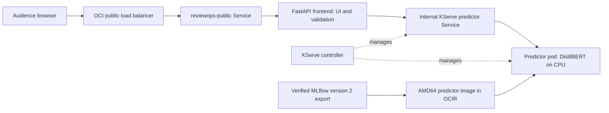

# ReviewOps: connect the browser application to KServe

The goal is to serve reviews through **Browser → OCI Load Balancer → FastAPI → KServe predictor**. The predictor is already Ready and its smoke test passed according to your terminal results. The user subsequently deployed the frontend and reported a passing public-LB smoke test on 2026-10-06, with `inference_backend: kserve` and the pinned model revision. This guide records the release procedure and verification. Cloud verification is based on the user’s terminal output; no cloud operation was executed by the assistant.

## What changes and why



| Component | Purpose in this example |
|---|---|
| OCI OKE | Runs Kubernetes and provisions the worker nodes hosting our pods. |
| OCI Container Registry | Stores our versioned AMD64 application images. |
| OCI Load Balancer | Provides the public address and forwards requests to ready frontend pods. |
| FastAPI frontend | Serves the browser UI, validates reviews, and makes HTTP requests to the predictor. |
| KServe InferenceService | Declares the predictor and lets the controller manage its Deployment and internal Service. |
| Predictor | Loads the exact exported pretrained checkpoint and performs CPU inference. |
| MLflow | Records evaluation, model version, run identity, and the export used to build the serving image. |

The frontend configures `REVIEWOPS_PREDICTOR_URL=http://reviewops-sentiment-predictor.reviewops.svc.cluster.local`. This is an internal Kubernetes DNS name. The frontend appends `/ready` and `/predict`; do not include those paths in the variable.

The frontend does not load local model weights when this variable is configured. It uses a 5-second network/socket timeout, disables redirects and proxy environment discovery, checks the pinned model identity and prediction fields, and returns HTTP 503 on predictor failure. Token-limit errors remain HTTP 422. Liveness stays HTTP 200 while a predictor is unavailable; readiness fails so the frontend is removed from Service endpoints. The public LB can report no healthy backends during a predictor outage.

The browser request and response shape remain compatible. Prediction JSON includes `inference_backend: kserve`, which the smoke test checks. The reported `inference_ms` is predictor compute time, not complete browser/network latency.

This first release retains the shared image recipe, including checkpoint files and CPU packages. They are unused in the frontend process; image storage remains approximately the same size as the earlier release. A smaller dedicated frontend image is a possible later refinement. No new training, model weights, or MLflow registration is required.

KServe runs Standard mode with a cluster-local predictor. Autoscaling is disabled for the first replica. This custom container keeps our existing `/predict` API; it is not a claim of KServe V1/V2 inference-protocol compliance. DVC, Kubeflow Pipelines, automated model promotion, and scale-to-zero are not part of this milestone.

## Local verification

The local two-container demo is available at http://127.0.0.1:8007. Its dedicated containers are `reviewops-frontend-local-v1` and `reviewops-predictor-frontend-test-v1`, on network `reviewops-frontend-test-v1`. These represent the HTTP connection; the local test does not run a KServe controller.

The frontend's local checkpoint path is deliberately missing. Successful predictions plus an inspected process map without `libtorch` confirm forwarding without local inference. The real predictor uses the previously verified AMD64 image. Predictor stop/recovery checks exercise 503 behavior and recovery; unit/integration fixtures exercise timeouts, malformed responses, revision mismatch, redirects, and input validation.

Final verification: **47 tests passed**, and the rebuilt AMD64 image passed real prediction, missing-local-checkpoint, predictor outage, and recovery checks. The fresh review finding for deeply nested JSON and truncated HTTP bodies was reproduced, fixed, and covered by regression checks returning HTTP 503.

Evidence is retained under `artifacts/container/`: `image-frontend-v1-amd64.json`, `build-frontend-v1-amd64.log`, `build-context-frontend-v1-amd64.json`, `smoke-frontend-v1-amd64.json`, `frontend-runtime-v1-amd64.json`, `frontend-outage-v1-amd64.json`, and `frontend-recovery-v1-amd64.json`.

## Push the new application image — user-run registry mutation

Use the same terminal through push and render. The existing KServe predictor keeps its original published digest `sha256:74f50915cf1ca53692b4bb73470b2128a50d85d3c1f7438365757c9c92643854`.

```bash
cd /Users/shivangpandya/Downloads/mlops
export OCI_CLI_PROFILE=axon
OKE_CONTEXT='context-cef-oke-liftoff-ch4yy43wxtq'
OCIR_REPO='iad.ocir.io/idtfszw3ugfy/reviewops'
FRONTEND_TAG="$OCIR_REPO:frontend-v1-amd64"

AUTH_DIR=$(mktemp -d)
chmod 700 "$AUTH_DIR"
AUTH_FILE="$AUTH_DIR/auth.json"
read -r -p 'Full OCIR login username: ' OCIR_USERNAME
podman login --authfile "$AUTH_FILE" --username "$OCIR_USERNAME" iad.ocir.io

podman tag localhost/reviewops:frontend-v1-amd64 "$FRONTEND_TAG"
podman push --authfile "$AUTH_FILE" \
  --digestfile artifacts/container/published-frontend-v1-digest.txt "$FRONTEND_TAG"
```

Enter the OCI auth token only at the password prompt. Continue only after push success; preserve the actual returned digest. `frontend-v1` is an application release tag; the model remains MLflow version 2.

## Render and review the deployment — local operation

```bash
FRONTEND_IMAGE_REF="$OCIR_REPO@$(cat artifacts/container/published-frontend-v1-digest.txt)"
printf '%s\n' "$FRONTEND_IMAGE_REF" > artifacts/container/published-frontend-v1-image.txt

.venv/bin/python render_oke_release.py \
  --image "$FRONTEND_IMAGE_REF" \
  --context "$OKE_CONTEXT" \
  --platform linux/amd64 \
  --predictor-url http://reviewops-sentiment-predictor.reviewops.svc.cluster.local \
  --output-dir dist/oke-reviewops-frontend-v1
```

Inspect `dist/oke-reviewops-frontend-v1/resources.yaml`. It must reference the new frontend digest and contain `REVIEWOPS_PREDICTOR_URL`. Image and environment arrive in a single Deployment update. The renderer refuses existing output directories; use a fresh output directory if repeating a render.

The bundle targets the existing `reviewops` Deployment and internal Service, and namespace. It does not include the KServe InferenceService or `reviewops-public` LoadBalancer Service. Applying an older bundle without the predictor variable would switch the application back to local inference.

## Deploy — user-run cluster mutation

Check that the predictor is Ready and the existing registry secret is present before proceeding. These commands do not print secret contents.

```bash
kubectl --context "$OKE_CONTEXT" -n reviewops get \
  inferenceservice/reviewops-sentiment secret/ocir-pull

kubectl --context "$OKE_CONTEXT" apply --dry-run=server \
  -f dist/oke-reviewops-frontend-v1/resources.yaml

kubectl --context "$OKE_CONTEXT" apply \
  -f dist/oke-reviewops-frontend-v1/resources.yaml

kubectl --context "$OKE_CONTEXT" -n reviewops \
  rollout status deployment/reviewops --timeout=300s

kubectl --context "$OKE_CONTEXT" -n reviewops get pods,services
```

Only continue after each command succeeds. The existing public Service selector still matches the frontend pods. The reported current LB address is `129.80.162.140`; check the actual Service address again if it changes.

## Verify the public flow

```bash
.venv/bin/python scripts/smoke_container.py \
  --base-url http://129.80.162.140 \
  --expect-backend kserve \
  --output artifacts/container/smoke-oke-frontend-v1.json
```

Expect `status: passed`, prediction `inference_backend: kserve`, and the pinned model revision. This distinguishes the new frontend from the previous standalone app. Inspect the running frontend image ID as release evidence:

```bash
kubectl --context "$OKE_CONTEXT" -n reviewops get pods -l app=reviewops \
  -o jsonpath='{range .items[*]}{.metadata.name}{" "}{.status.containerStatuses[0].imageID}{"\n"}{end}'
```

If you prefer private testing, use a second terminal with profile/context set explicitly:

```bash
export OCI_CLI_PROFILE=axon
OKE_CONTEXT='context-cef-oke-liftoff-ch4yy43wxtq'
kubectl --context "$OKE_CONTEXT" -n reviewops \
  port-forward service/reviewops 8005:8000
```

Run the same smoke test with base URL `http://127.0.0.1:8005` and `--expect-backend kserve` from another terminal.

## Diagnose or restore the previous application

If the frontend is not Ready, inspect its logs and events, then check the predictor's readiness, DNS/service routing, model revision, and any network policies between pods. No local inference fallback is attempted.

```bash
kubectl --context "$OKE_CONTEXT" -n reviewops logs deployment/reviewops
kubectl --context "$OKE_CONTEXT" -n reviewops get events --sort-by=.metadata.creationTimestamp
kubectl --context "$OKE_CONTEXT" -n reviewops rollout history deployment/reviewops
```

To restore the immediately preceding verified application revision after this rollout:

```bash
kubectl --context "$OKE_CONTEXT" -n reviewops rollout undo deployment/reviewops
kubectl --context "$OKE_CONTEXT" -n reviewops \
  rollout status deployment/reviewops --timeout=300s
```

The previous revision restores both its image and environment. Run the smoke test without `--expect-backend kserve` for the previous standalone image. Rollback requires the previous ReplicaSet to remain in rollout history. The predictor stays deployed independently.

Remove the temporary auth file after publication with `rm -f "$AUTH_FILE"` and `rmdir "$AUTH_DIR"`. It is not needed to replace the existing cluster pull secret. To clean up only this local integration demo, remove its two named containers and then `reviewops-frontend-test-v1`; do not delete the cloud namespace or shared cluster.
