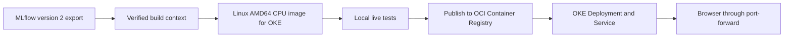

# ReviewOps: from a local container to OCI OKE

## What works now

The OKE-target Linux AMD64 CPU image is built and tested, with a local emulated demo at http://127.0.0.1:8004. The Arm64 image remains available for local testing at http://127.0.0.1:8002. The original local application remains on port 8000 and MLflow on port 5000. The container uses the verified MLflow version 2 export; it includes no MLflow server, evaluation dataset, or credentials.

Verified: correct positive/negative predictions, strict input limits, readiness, browser HTML, non-root UID 10001, read-only root filesystem, and real CPU inference with networking disabled. A separate missing-model container returned liveness 200 and readiness/prediction 503; that temporary container was removed. Evidence files are under `artifacts/container/`.

Update: the user completed original OKE deployment and smoke verification, reported Ready AMD64 workers, provisioned the public LB, and verified the KServe predictor. Context: `context-cef-oke-liftoff-ch4yy43wxtq`; OCI profile **axon**; OCIR repository `iad.ocir.io/idtfszw3ugfy/reviewops`. The commands below describe the original baseline. For the new pending frontend rollout, use [the KServe/frontend guide](reviewops-kserve-frontend.md).

## Explain the delivery path



The first four boxes have been exercised, with AMD64 testing under local emulation. The user subsequently verified the OCI delivery boxes through OKE smoke checks. Production throughput, capacity, and availability remain unmeasured.

| Component | Explain it to a beginner |
|---|---|
| Build context | A folder containing exactly the files the image builder may use. |
| Container image | The application, Python libraries, and model packaged for Linux. |
| CPU architecture | The instruction set a machine executes. Arm64 and AMD64 images are different. |
| Registry | A service that stores images for machines to download. OCIR is OCI's registry. |
| Digest | An identifier for image contents; it avoids an image tag silently moving to another release. |
| Worker node | A cloud machine that supplies CPU and memory for pods. |
| Namespace | A named group for our application's Kubernetes resources. |
| Deployment | A declaration of which image and how many copies should run. |
| Service | A stable internal address routing to ready application pods. |
| Probe | A periodic check of whether the application has started, is ready, or is alive. |

## Repeat the local container checks

Run commands from the project directory. These are local operations.

```bash
.venv/bin/python prepare_container.py --output-dir dist/reviewops-v2-new
podman build --platform linux/amd64 -t localhost/reviewops:mlflow-v2-amd64 dist/reviewops-v2-new
podman run -d --name reviewops-local-repeat --read-only \
  --tmpfs /tmp:rw,nosuid,size=128m --cap-drop ALL \
  --security-opt no-new-privileges -p 127.0.0.1:8004:8000 \
  --platform linux/amd64 localhost/reviewops:mlflow-v2-amd64
.venv/bin/python scripts/smoke_container.py --base-url http://127.0.0.1:8004
```

Preparation refuses existing output directories and inconsistent exports. The Dockerfile pins the resolved AMD64 Python base digest and installs PyTorch from its official CPU index. A build still requires network access to fetch packages. Serving does not need upstream model downloads.

Expect the smoke check to print `status: passed`. Remove only this repeat test container when finished:

```bash
podman rm -f reviewops-local-repeat
```

The OKE target is **Linux AMD64**. The existing Arm64 image is retained for local testing on this Mac. AMD64 tests on this Mac use emulation; native OKE performance and sizing still need verification. The default Dockerfile base is AMD64, and the renderer defaults to AMD64. To rebuild Arm64 locally, explicitly use `--platform linux/arm64` and `--build-arg BASE_IMAGE=docker.io/library/python:3.12-slim@sha256:16bf2b5c59a08523519d3c8589deca849285dee1d62a3653e124c3dba340f15e`. Never publish the Arm64 image for AMD64 workers or remove the node selector to make an incompatible image schedule.

## Before cloud deployment: user-run read-only checks

The commands below contact the selected OKE cluster. They have **not** been executed by this project workflow.

```bash
export OCI_CLI_PROFILE=axon
OKE_CONTEXT='context-cef-oke-liftoff-ch4yy43wxtq'
kubectl --context "$OKE_CONTEXT" cluster-info
kubectl --context "$OKE_CONTEXT" get nodes -L kubernetes.io/arch
kubectl --context "$OKE_CONTEXT" auth can-i create deployments.apps --namespace reviewops
kubectl --context "$OKE_CONTEXT" auth can-i create namespaces
```

Confirm this is the intended cluster, nodes are Ready, and suitable **amd64** capacity is available. The initial pod requests 1 CPU and 1 GiB; limits are 2 CPU and 2 GiB. These are initial settings, not measured OKE sizing. OCI profile selection does not replace Kubernetes role permissions or network access to a private cluster endpoint.

If no AMD64 worker capacity is available, provision compatible capacity before deployment. If the namespace must be created by an administrator, ask them to provision `reviewops` and grant the intended access.

## Publication: user-run commands that change registry state

Supply real values before using these commands. The repository must be the intended OCI destination, not inferred from another project's cached images.

```bash
export OCI_CLI_PROFILE=axon
OCIR_DOMAIN='<registry-domain>'
OCIR_REPO='<registry-domain>/<tenancy-namespace>/<repository-name>'
OCIR_USERNAME='<registry-login-username>'
AUTH_DIR=$(mktemp -d)
AUTH_FILE="$AUTH_DIR/auth.json"
podman login --authfile "$AUTH_FILE" --username "$OCIR_USERNAME" "$OCIR_DOMAIN"
podman tag localhost/reviewops:mlflow-v2-amd64 "$OCIR_REPO:mlflow-v2-amd64"
podman push --authfile "$AUTH_FILE" --digestfile artifacts/container/published-digest.txt \
  "$OCIR_REPO:mlflow-v2-amd64"
IMAGE_REF="$OCIR_REPO@$(cat artifacts/container/published-digest.txt)"
```

Use an OCI auth token at the login password prompt. Do not place the token in commands, source files, screenshots, or chat. The registry login username depends on your OCI identity configuration. OCI CLI profile `axon` is separate from the registry login. The auth file contains sensitive credentials; keep it private and remove it when the handoff is complete.

The push digest is publication evidence. Confirm the published image is AMD64 and corresponds to the tested local image and release labels; preserve its digest with the release record. Do not substitute a digest copied from a different image.

## Render the digest-pinned deployment locally

After publication evidence exists:

```bash
.venv/bin/python render_oke_release.py --image "$IMAGE_REF" \
  --context "$OKE_CONTEXT" --platform linux/amd64 --output-dir dist/oke-reviewops-v2
```

The renderer verifies exported files and model/run annotations and rejects tag-only images, malformed digests, and unsupported platforms. It does not query OCIR to verify caller-supplied image contents. The publisher must confirm the linkage between the tested image and its published digest.

`k8s/base/` is a template containing an intentionally invalid image placeholder. **Do not apply the base directly.** Use the rendered bundle. Local `kubectl kustomize k8s/base` is a formatting/assembly check, not proof that OKE will accept the workload.

## Deploy: user-run commands that change cluster state

The following commands create resources in the selected cluster. Review the rendered files and destination first. An existing `reviewops` namespace, Deployment, Service, or secret may belong to another project; confirm ownership before applying or replacing it.

```bash
export OCI_CLI_PROFILE=axon
kubectl --context "$OKE_CONTEXT" apply -f - <<'YAML'
apiVersion: v1
kind: Namespace
metadata:
  name: reviewops
YAML
kubectl --context "$OKE_CONTEXT" -n reviewops create secret generic ocir-pull \
  --type=kubernetes.io/dockerconfigjson --from-file=.dockerconfigjson="$AUTH_FILE" \
  --dry-run=client -o yaml | kubectl --context "$OKE_CONTEXT" apply -f -
kubectl --context "$OKE_CONTEXT" apply --dry-run=server -f dist/oke-reviewops-v2/resources.yaml
kubectl --context "$OKE_CONTEXT" apply -f dist/oke-reviewops-v2/resources.yaml
kubectl --context "$OKE_CONTEXT" -n reviewops rollout status deployment/reviewops --timeout=300s
kubectl --context "$OKE_CONTEXT" -n reviewops get pods -o wide
kubectl --context "$OKE_CONTEXT" -n reviewops logs deployment/reviewops
```

Server-side validation may require the namespace and registry secret to exist. It validates against the cluster; it is different from local YAML parsing. Expect the Deployment to become available and its pod to report Ready. If it does not, diagnose before claiming success.

In a separate terminal, set the destination again; shell variables from the first terminal are not inherited:

```bash
export OCI_CLI_PROFILE=axon
OKE_CONTEXT='context-cef-oke-liftoff-ch4yy43wxtq'
kubectl --context "$OKE_CONTEXT" -n reviewops port-forward service/reviewops 8005:8000
```

Open http://127.0.0.1:8005 and run:

```bash
.venv/bin/python scripts/smoke_container.py --base-url http://127.0.0.1:8005
```

Port-forward access is for the presenter's computer. This stage does not create a public audience website or load balancer.

## Verify and present the release

Show the MLflow run/version, exported `release.json`, image labels/digest, rendered Deployment annotations, and the running pod's image ID. Save rollout and prediction evidence. Correct predictions alone do not prove which image ran.

```bash
kubectl --context "$OKE_CONTEXT" -n reviewops get pods \
  -o jsonpath='{range .items[*]}{.metadata.name}{" "}{.status.containerStatuses[0].imageID}{"\n"}{end}'
```

The startup probe allows up to about five minutes for model initialization. Readiness gates Service traffic; liveness checks process responsiveness, not model accuracy. Network/security settings must allow the cluster to pull its private image.

## Troubleshooting, recovery, and rollback

| Symptom | First checks |
|---|---|
| ImagePullBackOff | Confirm repository, digest, registry domain, secret, and pull permissions. |
| Pending pod | Check node architecture, Ready state, resource capacity, and scheduling events. |
| Readiness 503 | Check model-loading logs, checksum errors, and memory limits. |
| Forbidden | Check Kubernetes permissions and selected OCI profile/authentication. |
| Cannot reach API server | Check the selected context and network access to the cluster endpoint. |

For events, use `kubectl --context "$OKE_CONTEXT" -n reviewops describe pod <pod-name>`.

To demonstrate replacement, identify one ReviewOps pod and delete only that pod. The Deployment should recreate it. With one replica, requests may be interrupted. This is Kubernetes recovery on OKE, not a zero-downtime demonstration.

Rollback needs a prior verified deployment revision. After a second image release exists, inspect `rollout history`, select the known prior revision, and use `rollout undo --to-revision=<revision>`, followed by rollout and prediction checks. MLflow registry versions 1 and 2 alone are not two Kubernetes deployment revisions; they contain the same pretrained weights here.

Remove the temporary registry auth file after its purpose is complete. Do not delete a shared namespace or cluster as cleanup. For a dedicated ReviewOps deployment, delete its Deployment and Service only after the demonstration no longer needs them; namespace/secret cleanup requires confirming ownership.

## Next stage

Once this baseline is deployed and verified, introduce KServe: FastAPI retains the UI and validation and calls a dedicated model predictor. The user has since installed KServe and verified its predictor. DVC and Kubeflow Pipelines remain future milestones; see [the frontend handoff](reviewops-kserve-frontend.md).
